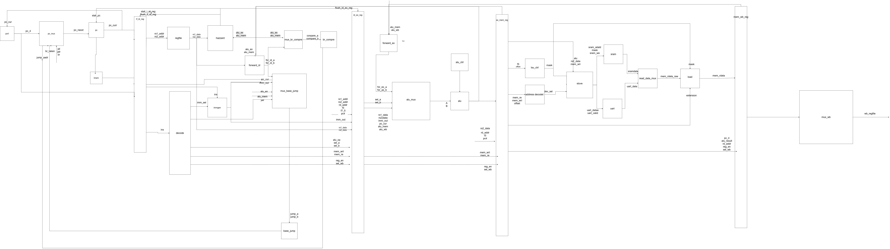
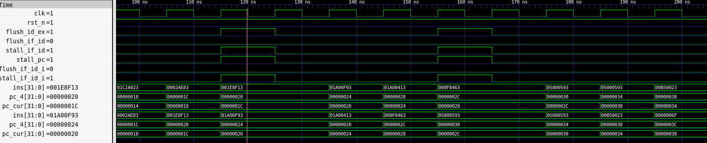
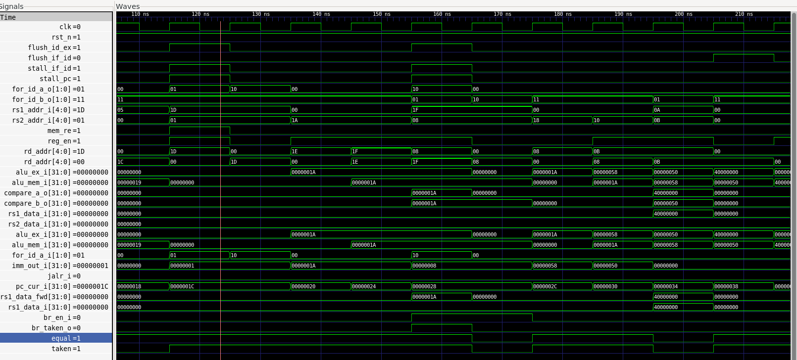
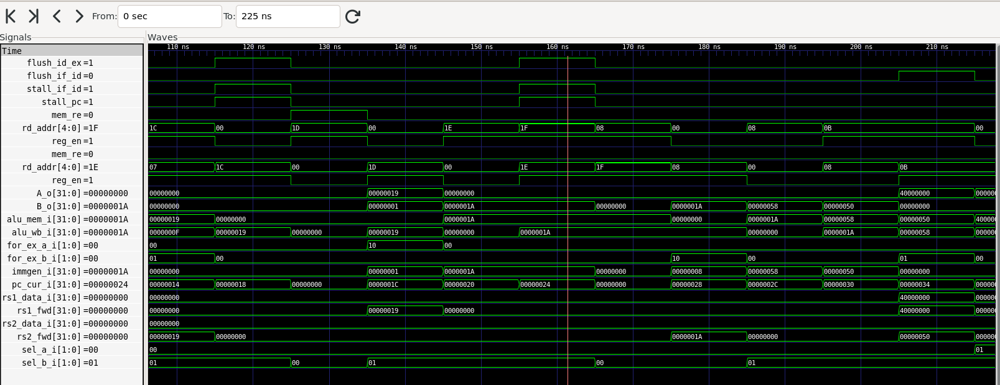

# RISCV_MINI — RV32I 5-Stage Pipelined CPU

> A solo RTL design + verification project: a SystemVerilog RV32I core with
> explicit hazard detection, data forwarding, early branch resolution, and
> directed testbenches with waveform-level evidence.

## Overview

This is an educational, from-scratch implementation of a 32-bit RISC-V
processor, built solo without a mentor or course framework. The goal was not
just to make a CPU run programs, but to design and *verify* the mechanisms
that make a pipelined CPU correct: pipeline registers, bypass/forwarding
paths, load-use stalls, and control-hazard flushing.

The core currently implements 37 base RV32I instructions and runs Hello World
and Fibonacci programs end-to-end through a memory-mapped UART. It follows a
classic five-stage pipeline:

```
IF → ID → EX → MEM → WB
```

This project is intended as an RTL design + verification bring-up project,
not yet a full RV32I compliance implementation — the "Current scope and next
steps" section below is deliberately explicit about what is and isn't done.

## Architecture



**Pipeline registers:** IF/ID, ID/EX, EX/MEM, MEM/WB
**Peripherals:** SRAM (instruction/data memory), UART (memory-mapped I/O at `0x4000_0000`)

### Pipeline control signals

| Signal | Purpose |
|---|---|
| `stall_pc` | Holds the program counter during a data hazard |
| `stall_if_id` | Holds the IF/ID register so the dependent instruction stays in ID |
| `flush_id_ex` | Inserts a bubble into EX after a load-use stall |
| `flush_if_id` | Removes the wrong-path instruction after a taken branch/jump |

### Forwarding paths

- **EX-stage forwarding** — resolves back-to-back ALU dependencies without
  stalling, sourcing operands from EX/MEM and MEM/WB.
- **ID-stage forwarding** — resolves branch/JALR comparator operands early
  (in ID, not EX), which is what makes early branch resolution possible
  without extra hazards.

## Waveform evidence

Captured from the pipeline demo testbench in GTKWave. This directed test
creates, in sequence: an ALU dependency resolved by EX forwarding, a
load-use dependency that forces a stall + bubble, and a branch whose
operands are forwarded into ID and whose wrong-path instruction gets
flushed.

### 1. Load-use hazard — stall and flush



At the point where instruction `001E8F13` depends on a value from the
instruction immediately before it (a load), `stall_pc` and `stall_if_id`
assert for one cycle to hold the pipeline in place, and `flush_id_ex`
asserts on the following cycle to insert a bubble into EX — preventing the
dependent instruction from reading a stale register value.

### 2. ID-stage forwarding — branch operand resolution



`for_id_a` and `for_id_b` show the forwarding-mux select signals feeding the
branch comparator. At the directed `beq x31, x8` test point: `for_id_a = 10`
(operand forwarded from MEM) and `for_id_b = 01` (operand forwarded from
EX), giving `compare_a = compare_b = 0x1A`, so the branch resolves taken —
demonstrating that early (ID-stage) branch resolution works correctly even
when the branch depends on very recently produced results.

### 3. EX-stage forwarding — ALU operand bypass



`for_ex_a` / `for_ex_b` show the ALU forwarding-mux selects. The trace shows
`alu_ex`, `alu_mem`, and `alu_wb` values threading through the pipeline
registers, confirming that a result produced by one instruction is bypassed
directly to a dependent instruction in EX the very next cycle — no stall
needed for this class of hazard.

## Repository layout

```
.
├── rtl/
│   ├── core/
│   │   ├── if_stage/          # PC, PC mux, instruction memory
│   │   ├── id_stage/          # Decode, regfile, hazard unit, ID forwarding
│   │   ├── ex_stage/          # ALU, ALU control, EX forwarding
│   │   ├── mem_stage/         # SRAM, load/store units, UART
│   │   ├── wb_stage/          # Write-back mux
│   │   └── top_rtl.sv         # Processor integration top
│   ├── controlpath/           # Pipeline register modules
│   └── pkg/                   # ISA, control, and shared type packages
├── tb/
│   ├── tb_hello_world_top.sv
│   ├── tb_fibonacci_top.sv
│   └── tb_pipeline_demo_top.sv
├── list_file/
│   ├── hello_world.f
│   ├── fibonacci.f
│   └── pipeline_demo.f
├── program_hello.mem
├── program_fibonacci.mem
├── program_pipeline_demo.mem
└── doc/image/                 # Diagram + waveform captures used in this README
```

## Prerequisites

Tested on Ubuntu/WSL.

```bash
sudo apt update
sudo apt install -y verilator gtkwave make g++
verilator --version
gtkwave --version
```

## Running the simulations

Each test uses its own build directory so simulator artifacts don't collide.

### 1. Hello World

Writes `Hello World!` through the memory-mapped UART.

```bash
verilator --binary --timing -Wall -Wno-fatal -sv \
  -f list_file/hello_world.f --top-module tb_top \
  --Mdir obj_dir_hello

./obj_dir_hello/Vtb_top
```

Expected output:
```
Hello World!
[TB][PASS] UART printed: Hello World!
```

### 2. Fibonacci

Computes and prints the first seven Fibonacci numbers, exercising
arithmetic, register dependencies, a decrementing loop, `BNE`, and UART
stores.

```bash
verilator --binary --timing -Wall -Wno-fatal -sv \
  -f list_file/fibonacci.f --top-module tb_fibonacci_top \
  --Mdir obj_dir_fibonacci

./obj_dir_fibonacci/Vtb_fibonacci_top
```

Expected output:
```
0 1 1 2 3 5 8
[TB][PASS] Fibonacci UART output: 0 1 1 2 3 5 8
```

### 3. Pipeline hazard / forwarding / early-branch demo

The directed test behind the waveforms above.

```bash
verilator --binary --timing --trace --trace-structs -Wall -Wno-fatal -sv \
  -f list_file/pipeline_demo.f --top-module tb_top \
  --Mdir obj_dir_pipeline

./obj_dir_pipeline/Vtb_top
gtkwave pipeline_demo.vcd
```

The test passes only when the UART emits `P` (the wrong-path `X` store must
be flushed) and all checked register results are correct.

## Verification strategy

| Test | What it checks | Result |
|---|---|---|
| Hello World | Reset, fetch, ALU/write-back path, UART store | Passed |
| Fibonacci | Arithmetic loop, register dependencies, `BNE`, UART stores | Passed (directed regression) |
| Pipeline demo | EX forwarding, load-use stall, ID forwarding, branch flush | Passed (waveform evidence above) |

### Functional coverage

The repository also includes a transaction-based functional coverage model
for the IF-stage verification environment (`if_stage_coverage`):

| Coverage area | Examples |
|---|---|
| Control | PC stall, branch enable/taken, JAL, JALR, redirect vs. no-redirect |
| Cross coverage | stall × redirect, branch-enable × branch-taken |
| Redirect | branch/JAL/JALR source and jump-target bins |
| Instruction fetch | RV32I opcode classes, NOP vs. non-NOP fetches |
| PC properties | alignment, `PC + 4` relation, jump-target observation |

This is currently block-level IF-stage coverage, not a single aggregate
metric for the whole core. Extending this into a full-core coverage plan is
listed under Next steps.

## Design decisions

**Early branch resolution.** Branches resolve in ID rather than EX to reduce
the control-hazard penalty. Since branch operands can come from instructions
still in flight, ID includes its own forwarding logic (see waveform #2
above) plus hazard detection for cases that can't be safely bypassed.

**Memory-mapped UART.** The address decoder routes accesses at `0x4000_0000`
to a UART model; a valid write prints the low byte to the console in
simulation, making software bring-up observable without a separate
peripheral model.

**Instruction memory image.** Simulation program images are word-oriented
hex files loaded via `$readmemh`. The instruction memory indexes words with
`PC[11:2]`, matching the byte-addressed RISC-V PC with 32-bit instructions.

## Current scope and next steps

**Implemented and demonstrated:**
- Five-stage pipelined RTL integration, 37 RV32I instructions
- Hazard detection, EX/ID forwarding, and early branch control
- Simulation SRAM and UART models
- Directed self-checking testbenches with waveform-level verification
- Block-level functional coverage for the IF stage

**Planned:**
- Self-checking ISA regression suite with randomized instruction sequences
- Coverage for remaining RV32I corner cases, alignment, illegal instructions
- Full data-memory tests (byte/halfword/word access, sign extension)
- Assertions and coverage for stalls, bypasses, and flushes across all stages
- ELF-to-memory-image flow driven by the RISC-V GCC toolchain
- FPGA top-level integration, timing closure, and physical UART demo

## Author

**Minh** — Electronics & Telecommunications (IoT track) student, self-taught
in RTL design and verification. Built solo, without a course framework, as
preparation for RTL Design / Design Verification roles.

If you're reviewing this for an internship: start with the [pipeline demo
waveforms](#waveform-evidence) above — they show the hazard and forwarding
mechanisms that are usually the hardest part of a first CPU project to get
right and to prove.